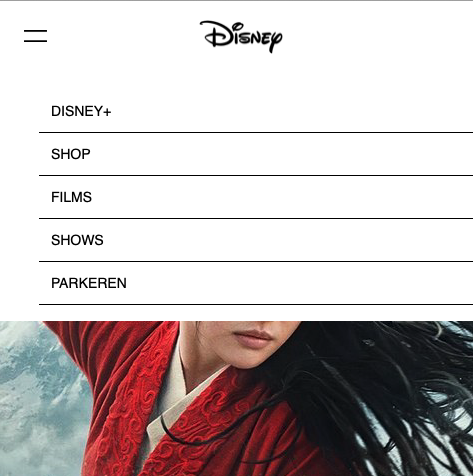
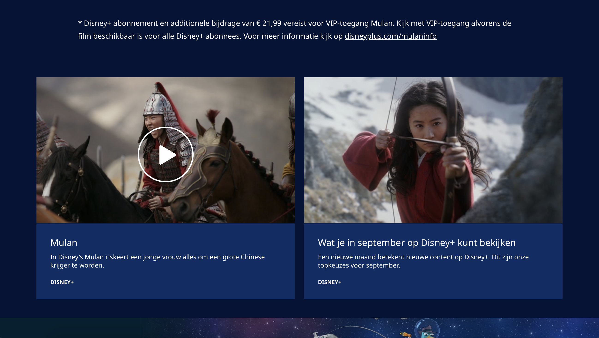
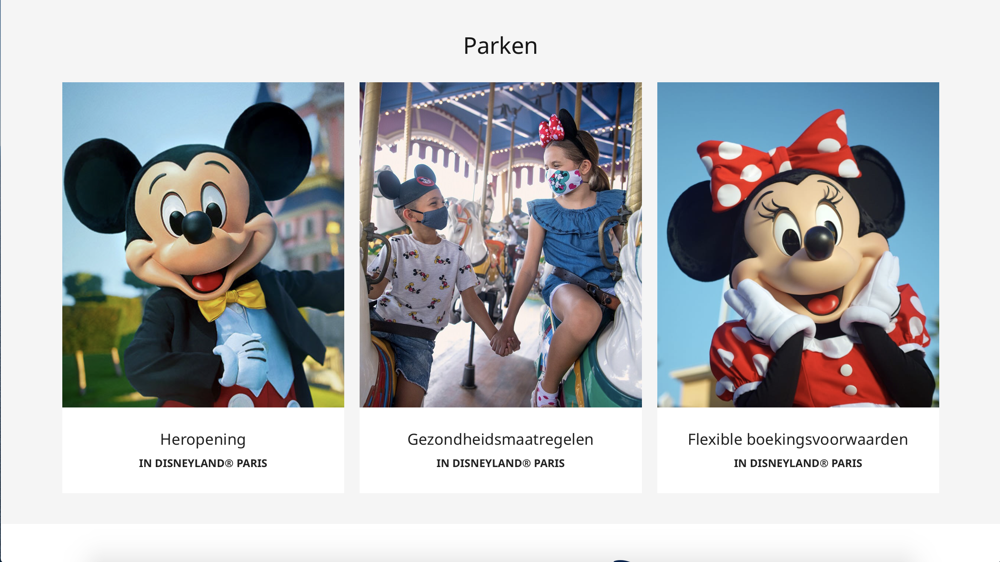
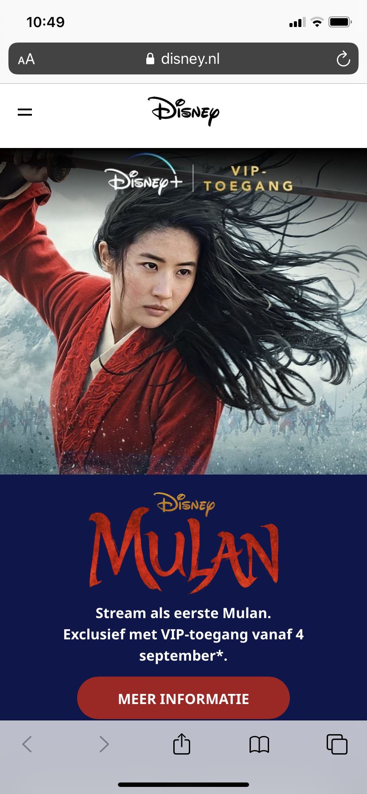
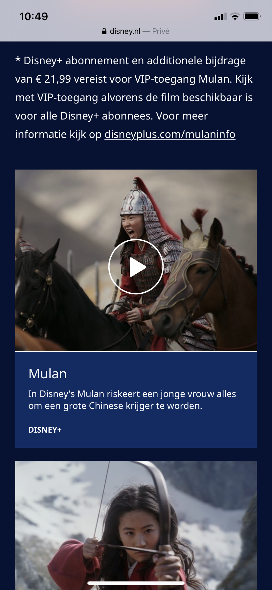
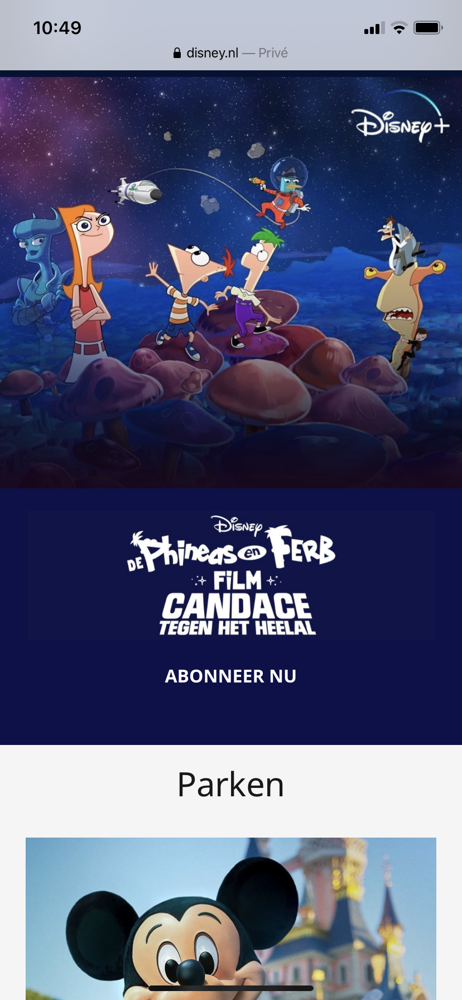
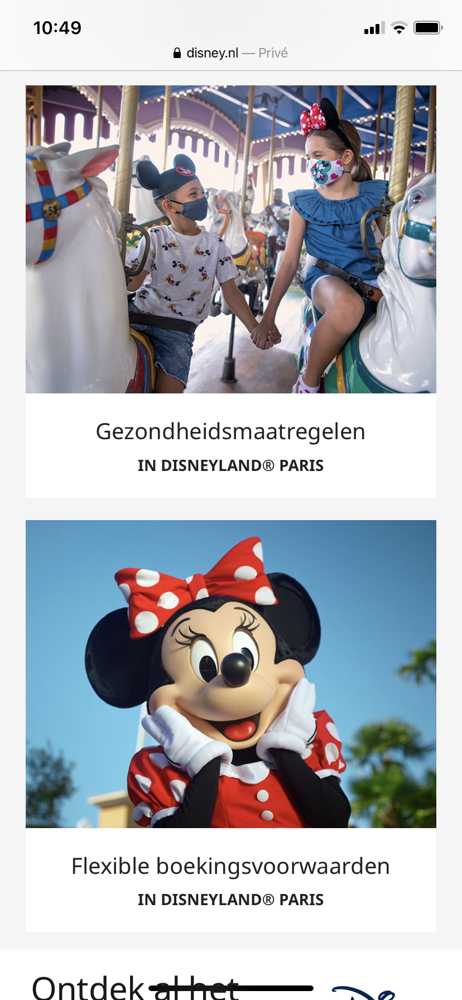
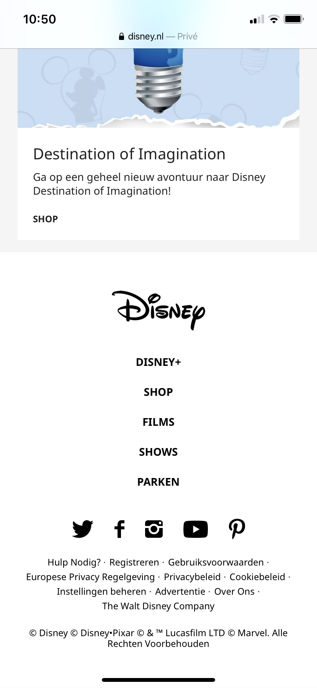

# Procesverslag
**Auteur:** -Andrei Motian-

Markdown cheat cheet: [Hulp bij het schrijven van Markdown](https://github.com/adam-p/markdown-here/wiki/Markdown-Cheatsheet). Nb. de standaardstructuur en de spartaanse opmaak zijn helemaal prima. Het gaat om de inhoud van je procesverslag. Besteedt de tijd voor pracht en praal aan je website.

## Bronnenlijst
1. -bron 1-
2. -bron 2-
3. -...-

## Eindgesprek (week 7/8)

-dit ging goed & dit was lastig-

**Screenshot(s):**

-screenshot(s) van je eindresultaat-

## Voortgang 3 (week 6)

-same as voortgang 1-

## Voortgang 2 (week 5)

### Stand van zaken

-Mobiele homepage is z.g.a. af. Heb een microinteractie die geanimeerd wordt. 

Fonts zijn niet hetzelfde als op de website van Disney, ik heb een vergelijkbare font gebruikt. Wat minder goed ging was om een svg te animeren om een menu te maken. Dit was uiteindelijk niet gelukt, ik heb met before en after gewerkt en nu begrijp ik ook wat het doet in mijn code.-

### Agenda voor meeting Andrei & Nadja

-Moet de menu in een kruisje veranderen. Mag ik een pagina toevoegen in de nav. Vragen om goedkeuring van mijn gebruik van classes. Zijn de animaties die we hebben voldoende?-

## Voortgang 1 (week 3)

### Stand van zaken

-Het maken van een navigatie met flexbox en het gebruik van javascript om de navigatie in en uit te klappen ging goed.

Het gebruik van nth-type ging minder goed omdat er bij mij alle elementen geselecteerd worden binnen een section ipv een element. Kruisjes in javascript met foutmelding. Burger menu veranderen naar kruis, ik weet niet hoe ik dit moet doen.-

**Screenshot(s):**

### Agenda voor meeting

-Waarom wel of geen class gebruiken ipv nth-type? Foutmeldingen in javascript. Veranderen van burger menu naar kruis. Vragen over microinteracties: hamburger menu, inzoomen van afbeelding met css? Foto's laten overlappen met positioning of iets anders? Hoe krijg je afbeeldingen in de read me bestand. Sims website schuine blok onder afbeelding.-

### Verslag van meeting

-1. Bij de nth type en child selectors moest ik beter in mijn html kijken waar ik precies de element in had geplaatst om het aan te spreken. VB, moest de eerste link slecteren maar de eerste twee links werden gestyled. Dat kwam omdat de eerste link in een article zat en die niet specifiek had aangesproken. 2. De errors die ik kreeg in JavaScript waren errors die ik kon negeren. In het eerste jaar had ik altijd een regel boven in mijn js bestand, als ik die nu weer gebruik gaan die errors weg. 3. Ik ben uitgedaagd om mijn burgermenu te animeren, dat kan ik doen door ipv een png een svg bestand te gebruiken waardoor de twee strepen een kruis worden. 4. Door de juiste syntax te gebruiken in dit readme bestand weet ik hoe ik een afbeelding kan laten zien. 5. Feedback van docent: Het gaat de goede kant op en de styling zag er tot nu toe al goed uit.-

## Intake (week 1)

**Je startniveau:** -Rood-

**Je focus:** -1b. Responsive website-

**Je opdracht:** -https://disney.nl-

**Screenshot(s):**

 
 
 
 
 
 
 
 

**Breakdown-schets(en):**

