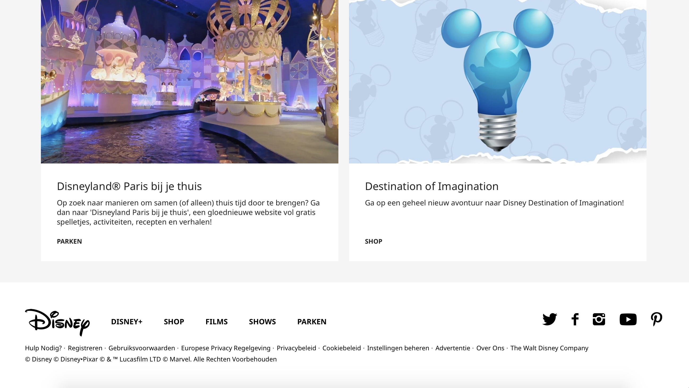

# Procesverslag
**Auteur:** -Andrei Motian-

Markdown cheat cheet: [Hulp bij het schrijven van Markdown](https://github.com/adam-p/markdown-here/wiki/Markdown-Cheatsheet). Nb. de standaardstructuur en de spartaanse opmaak zijn helemaal prima. Het gaat om de inhoud van je procesverslag. Besteedt de tijd voor pracht en praal aan je website.

## Bronnenlijst
1. -Alle afbeeldingen komen van de website van Disney. www.disney.nl-
2. - Deze bron heb ik gebruikt om te experimenteren met dark mode media query https://css-tricks.com/dark-modes-with-css/-

## Eindgesprek (week 7/8)

-Ik heb veel moeite gehad op zowel de homepage als de detailpage de elementen onder de header te positioneren, de heading, afbeelding en anchor link op de goede plek te krijgen als het naar desktop gaat. Ik wil proberen om voor de ophoging van mijn cijfer te gaan, dit heb ik gedaan door de website ook in dark mode te laten zien. Als je gebruiker zijn instellingen op zijn device op donker heeft staan ziet hij de website in dark mode. Dit heb ik gedaan door een media query te gebruiken en dit is goed gegaan. De informatie over de film op de detailpagina heb ik anders gepositioneerd dan op de oorspronkelijke website omdat ik dat beter uit vond zien. Op de oorspronkelijke website op mobiel was onoverzichtelijk omdat de afbeelding en tekst naast elkaar staan en het niet fijn leest.  -

-Homepagina voor mobiel en desktop-
 

-Homepagina voor mobiel en desktop in dark mode-
 

-Detailpagina voor mobiel en desktop-

-Detailpagina voor mobiel en desktop in dark mode-

## Voortgang 3 (week 6)

### Stand van zaken

-Soort van opnieuw begonnen met de website. Alle content veranderd met het meest recente van Disney. Alle content op detailpagina is aanwezig, moet nog gestyled worden. Op de homepage zijn de eerste twee sections al responsive en heb bij de tweede section met grid gewerkt.-

### Agenda voor meeting Andrei & Nadja

-Problemen met img bij schalen. Tips voor een alt tekst bij afbeeldingen? Eerste 2 img naast elkaar krijgen op desktop. Article grid bij movies centreren. Blauwe rand bij button en andere dingen. Originele sims website gebruikt 20 verschillende achtergonden voor resposive, Nadja heeft een img gebuikt en die gestyled,  resposive schalen wordt daarom lastig. Bij Nadja zijn er veel elementen op de website waardoor het resposive maken lastig is.-

### Verslag van meeting

-Problemen bij de afbeeldingen met schalen is opgelost door een width te geven in plaats van een max width. Bij mijn alt tekst moet ik dingen als "afbeelding" of "foto van" weg halen. Problemen die ik met grid had zijn opgelost door de breedte op 50% in plaats van 45%. Feedback van docent: Ben goed op weg en kijken of ik mezelf kan uitdagen om voor ophoging te gaan.-

## Voortgang 2 (week 5)

### Stand van zaken

-Mobiele homepage is z.g.a. af. Heb een microinteractie die geanimeerd wordt. 

Fonts zijn niet hetzelfde als op de website van Disney, ik heb een vergelijkbare font gebruikt. Wat minder goed ging was om een svg te animeren om een menu te maken. Dit was uiteindelijk niet gelukt, ik heb met before en after gewerkt en nu begrijp ik ook wat het doet in mijn code.-

### Agenda voor meeting Andrei & Nadja

-Moet de menu in een kruisje veranderen. Mag ik een pagina toevoegen in de nav. Vragen om goedkeuring van mijn gebruik van classes. Zijn de animaties die we hebben voldoende?-

### Verslag van meeting

-Ik heb tips gekregen hoe ik grids kan toevoegen omdat ik dit heel lastig vond. Door grid garden te spelen is dit me iets duidelijker geworden maar moet het toch nog vaak opzoeken. Ik gebruik classes alleen voor de section van een onderwerp, als ik in mijn css zo te werk ga, main .classnaam article h2, mag ik dit doen omdat het zo nog voor de lezer overzichtelijk blijft om het in mijn html terug te vinden. Voor toegankelijkheid moet ik nog alt tekst toevoegen aan mijn afbeeldingen, dat ben ik helemaal vergeten te doen. Ik mag wat meer comments toevoegen in mijn code zodat het voor een andere lezer ook duidelijk is. Feedback van student assistent: Ben al redelijk ver en goed op weg. Hij gaat nog navragen over mijn detailpage. Na overleg met Danny heb ik een detailpage gekozen van een film om na te maken, Black Widow.-

## Voortgang 1 (week 3)

### Stand van zaken

-Het maken van een navigatie met flexbox en het gebruik van javascript om de navigatie in en uit te klappen ging goed.

Het gebruik van nth-type ging minder goed omdat er bij mij alle elementen geselecteerd worden binnen een section ipv een element. Kruisjes in javascript met foutmelding. Burger menu veranderen naar kruis, ik weet niet hoe ik dit moet doen.-

**Screenshot(s):**

### Agenda voor meeting

-Waarom wel of geen class gebruiken ipv nth-type? Foutmeldingen in javascript. Veranderen van burger menu naar kruis. Vragen over microinteracties: hamburger menu, inzoomen van afbeelding met css? Foto's laten overlappen met positioning of iets anders? Hoe krijg je afbeeldingen in de read me bestand. Sims website schuine blok onder afbeelding.-

### Verslag van meeting

-1. Bij de nth type en child selectors moest ik beter in mijn html kijken waar ik precies de element in had geplaatst om het aan te spreken. VB, moest de eerste link slecteren maar de eerste twee links werden gestyled. Dat kwam omdat de eerste link in een article zat en die niet specifiek had aangesproken. 2. De errors die ik kreeg in JavaScript waren errors die ik kon negeren. In het eerste jaar had ik altijd een regel boven in mijn js bestand, als ik die nu weer gebruik gaan die errors weg. 3. Ik ben uitgedaagd om mijn burgermenu te animeren, dat kan ik doen door ipv een png een svg bestand te gebruiken waardoor de twee strepen een kruis worden. 4. Door de juiste syntax te gebruiken in dit readme bestand weet ik hoe ik een afbeelding kan laten zien. 5. Feedback van docent: Het gaat de goede kant op en de styling zag er tot nu toe al goed uit.-

## Intake (week 1)

**Je startniveau:** -Rood-

**Je focus:** -1b. Responsive website-

**Je opdracht:** -https://disney.nl-

**Screenshot(s):**

 
 
 
 
 
 
 
 

**Breakdown-schets(en):**

